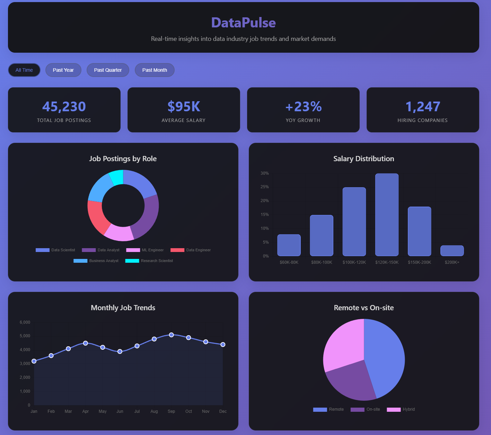

# DataPulse - Data Industry Job Trends Dashboard

[](https://yourusername.github.io/datapulse-dashboard)
[](https://github.com/yourusername/datapulse-dashboard)
[](LICENSE)

> A modern, interactive dashboard that visualizes real-time data industry job trends, salary insights, and market demands with beautiful glassmorphism design.



## 🚀 Live Demo

**[View Live Dashboard](https://yourusername.github.io/datapulse-dashboard)**

## 📋 Project Description

DataPulse is a comprehensive web-based dashboard that provides insights into the data industry job market. Built with modern web technologies, it features interactive charts, real-time statistics, and a responsive design that works seamlessly across all devices.

The dashboard analyzes job postings, salary distributions, skill demands, and hiring trends to help data professionals make informed career decisions and stay updated with market dynamics.

## 🛠️ Technologies Used

- **HTML5** - Semantic markup and structure
- **CSS3** - Modern styling with Flexbox/Grid, animations, and glassmorphism effects
- **JavaScript (ES6+)** - Interactive functionality and data manipulation
- **Chart.js 3.9.1** - Dynamic data visualizations
- **Responsive Design** - Mobile-first approach with CSS Grid and Flexbox

### Key Technical Features
- **Glassmorphism UI** - Modern frosted glass design with backdrop filters
- **CSS Animations** - Smooth transitions and hover effects
- **Interactive Charts** - Multiple chart types (Doughnut, Bar, Line, Pie)
- **Dynamic Data Filtering** - Time-based statistics updates
- **Responsive Layout** - Adaptive design for all screen sizes

## ✨ Features Overview

### 📊 Interactive Data Visualizations
- **Job Distribution by Role** - Doughnut chart showing data science, analyst, and engineering positions
- **Salary Range Analysis** - Bar chart displaying compensation distribution across experience levels
- **Monthly Hiring Trends** - Line chart tracking job posting volumes over time
- **Work Location Breakdown** - Pie chart comparing remote, on-site, and hybrid opportunities

### 📈 Real-time Statistics
- **Live Job Counts** - Total active job postings with animated counters
- **Average Salary Tracking** - Market compensation insights
- **Growth Rate Indicators** - Year-over-year industry expansion metrics
- **Company Participation** - Number of organizations actively hiring

### 🎛️ Dynamic Filtering
- **Time-based Filters** - All Time, Past Year, Quarter, and Month views
- **Interactive Updates** - Statistics refresh based on selected time period
- **Smooth Transitions** - Animated data changes for better UX

### 🏢 Market Intelligence
- **Skills Demand Grid** - Most sought-after technical skills (Python, SQL, ML, etc.)
- **Top Hiring Companies** - Industry leaders with position counts and salary ranges
- **Trend Indicators** - Growth/decline metrics for each organization

### 📱 User Experience
- **Fully Responsive** - Optimized for desktop, tablet, and mobile devices
- **Modern Design** - Glassmorphism effects with gradient backgrounds
- **Interactive Elements** - Hover effects, click animations, and smooth transitions
- **Accessibility** - Semantic HTML and proper contrast ratios

## 🏗️ Project Structure

```
datapulse-dashboard/
├── index.html              # Main dashboard file
├── README.md              # Project documentation
├── LICENSE                # MIT License
├── assets/
│   └── dashboard-preview.png  # Dashboard screenshot
└── .github/
    └── workflows/
        └── pages.yml      # GitHub Pages deployment
```

## 🚀 Getting Started

### Quick Start
1. **Clone the repository**
   ```bash
   git clone https://github.com/yourusername/datapulse-dashboard.git
   cd datapulse-dashboard
   ```

2. **Open in browser**
   ```bash
   # Simply open index.html in your browser
   open index.html
   
   # Or serve with a local server
   python -m http.server 8000
   # Navigate to http://localhost:8000
   ```

### Deploy to GitHub Pages
1. **Push to GitHub**
   ```bash
   git add .
   git commit -m "Initial commit"
   git push origin main
   ```

2. **Enable GitHub Pages**
   - Go to repository Settings
   - Navigate to Pages section
   - Select "Deploy from a branch"
   - Choose "main" branch and "/ (root)"
   - Save and wait for deployment

## 📊 Data Sources

The dashboard currently uses realistic sample data for demonstration purposes. In a production environment, this would connect to:

- Job board APIs (Indeed, LinkedIn, Monster)
- Company career pages
- Salary databases (Glassdoor, PayScale)
- Industry reports and surveys

## 🎨 Design Philosophy

### Glassmorphism Aesthetic
- **Frosted Glass Effects** - Backdrop blur filters create depth
- **Gradient Backgrounds** - Purple-blue gradients for modern appeal
- **Subtle Animations** - Enhance user engagement without distraction
- **Clean Typography** - Segoe UI for excellent readability

### User-Centric Design
- **Intuitive Navigation** - Clear visual hierarchy and logical flow
- **Responsive First** - Mobile-optimized with progressive enhancement
- **Performance Focused** - Lightweight assets and efficient rendering
- **Accessibility Aware** - Semantic HTML and color contrast compliance

## 🔧 Customization

### Adding New Chart Types
```javascript
// Example: Adding a new radar chart
const skillsCtx = document.getElementById('skillsChart').getContext('2d');
charts.skills = new Chart(skillsCtx, {
    type: 'radar',
    data: {
        labels: ['Python', 'SQL', 'ML', 'AWS', 'Tableau'],
        datasets: [{
            label: 'Skill Demand',
            data: [90, 85, 75, 70, 65],
            backgroundColor: 'rgba(102, 126, 234, 0.2)',
            borderColor: '#667eea'
        }]
    }
});
```

### Styling Modifications
```css
/* Custom color scheme */
:root {
    --primary-gradient: linear-gradient(135deg, #your-color1, #your-color2);
    --accent-color: #your-accent;
    --text-color: #your-text;
}
```

## 🤝 Contributing

Contributions are welcome! Please feel free to submit a Pull Request. For major changes, please open an issue first to discuss what you would like to change.

### Development Setup
1. Fork the repository
2. Create your feature branch (`git checkout -b feature/AmazingFeature`)
3. Commit your changes (`git commit -m 'Add some AmazingFeature'`)
4. Push to the branch (`git push origin feature/AmazingFeature`)
5. Open a Pull Request

## 📝 License

This project is licensed under the MIT License - see the [LICENSE](LICENSE) file for details.

## 📧 Contact

**Your Name** - [your.email@example.com](mailto:your.email@example.com)

**Project Link** - [https://github.com/yourusername/datapulse-dashboard](https://github.com/yourusername/datapulse-dashboard)

## 🙏 Acknowledgments

- [Chart.js](https://www.chartjs.org/) - Beautiful JavaScript charting library
- [Glassmorphism](https://glassmorphism.com/) - Design inspiration
- [GitHub Pages](https://pages.github.com/) - Free hosting platform
- Data industry professionals for insights and feedback

---

⭐ **Star this repository if you found it helpful!**
